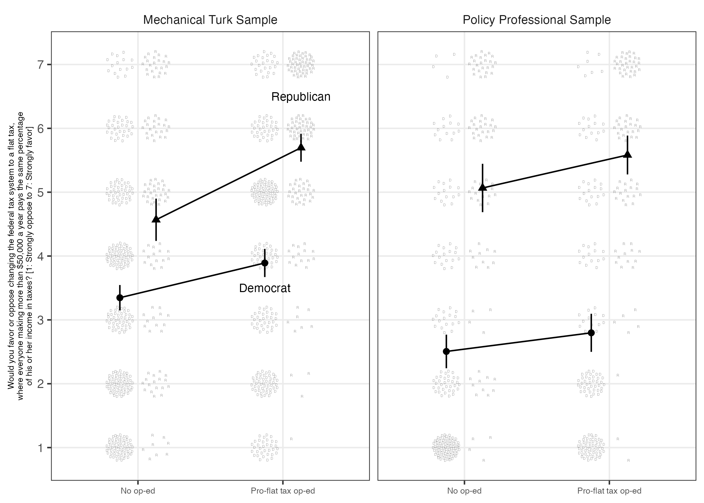
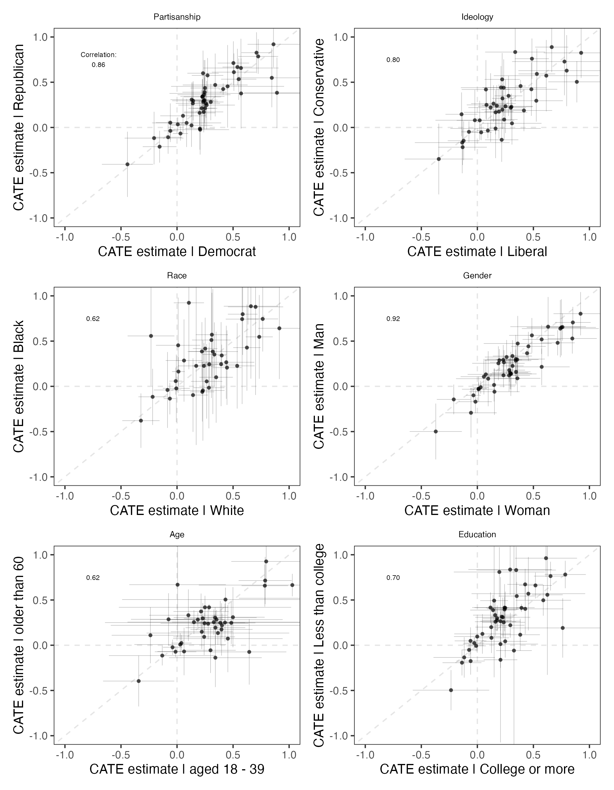

# Reproduction report: *Persuasion in Parallel* (Coppock 2022)


- [What this repository is](#what-this-repository-is)
- [The book](#the-book)
  - [A limitation of this report, stated
    first](#a-limitation-of-this-report-stated-first)
- [The deposited archive](#the-deposited-archive)
  - [Does the deposited code run?](#does-the-deposited-code-run)
  - [Why `value_script` is empty](#why-value_script-is-empty)
- [Chapter 6 is unseeded](#chapter-6-is-unseeded)
- [The extraction and the two
  instruments](#the-extraction-and-the-two-instruments)
  - [What the extraction does not
    cover](#what-the-extraction-does-not-cover)
- [Ground truth](#ground-truth)
  - [Float coverage](#float-coverage)
  - [The appendix](#the-appendix)
- [Errata](#errata)
- [The maintained rewrite](#the-maintained-rewrite)
- [Verification](#verification)
  - [The figures](#the-figures)
  - [The pipeline](#the-pipeline)
- [R environment](#r-environment)
- [Licence](#licence)

*Drafted by Claude Opus 5 under the supervision of Alex Coppock.*

## What this repository is

This repository re-runs the empirical content of *Persuasion in
Parallel: How Information Changes Minds about Politics* (Alexander
Coppock, University of Chicago Press, 2022) against a current R
environment, rewrites the analysis in modern idiom, and checks every
number the maintained code produces against the number the book prints.

| Item | Link |
|----|----|
| Book | <https://doi.org/10.7208/chicago/9780226821832.001.0001> |
| Publisher page | <https://press.uchicago.edu/ucp/books/book/chicago/P/bo181475008.html> |
| Replication archive | <https://doi.org/10.7910/DVN/I9GSKI> |

    coppock_2022/
      download_original.R          fetches and verifies the deposited archive
      run_all.R                    the entry point: sources everything, in order
      original/                    the deposited zip (not redistributed; gitignored)
      original_extracted/          the unpacked deposit (rebuilt on every run; gitignored)
      original_manifest.csv        the deposited file, its size and its published checksums
      original_members_manifest.csv  every member of the zip, by size and checksum
      maintained/                  the rewrite; one script per figure or table
      maintained/output/           everything the rewrite writes
      maintained/in_text_claims.R  the second instrument
      ground_truth/                the extraction, the build, and the comparison
      report/                      the rendered PDF of this document

To reproduce: clone the repository, open `coppock_2022.Rproj`, and run

``` r
source("run_all.R")
```

`run_all.R` fetches the archive from Dataverse, verifies it, runs all 28
analysis scripts, builds the ground truth, prints the in-text claims,
and re-verifies the deposit. It took 4.5 minutes on the machine that
produced the committed output; that figure describes one machine on one
day and nothing else.

## The book

*Persuasion in Parallel* argues that persuasive information moves the
opinions of opposing groups in the same direction by similar amounts,
and that the backlash effects predicted by motivated reasoning theory
are rare. The evidence is 23 survey experiments, some original, some
replications and reanalyses of published studies, reported across seven
chapters and an appendix. Twelve of the experiments carry a panel
component that supports the persistence analysis of chapter 6.

The book contains 67 numbered floats: 37 figures, 11 tables in the main
text, and 19 in the appendix.

### A limitation of this report, stated first

**The only copy of the book available to this repository is the
uncorrected proof.** Every page carries the running foot *Uncorrected
Proofs for Review Only*, dated 26 May 2022, and two running heads still
read “Appendix 000” and “Notes to Pages 000-000” where the final page
numbers had not been resolved. Published values in the ground truth are
therefore transcribed from that proof rather than from the printed book.

The discrepancies the pipeline found are properties of the analysis
rather than of the typesetting, so they do not depend on which copy is
read, and `errata.qmd` states them with their corrected values computed
at render time. Four of the five were checked against the printed
edition, so none of those is an artifact of the proof or of the way a
PDF’s text layer is read. The fifth, errata entry 2, is the set of
chapter 6 sentences that disagree with the chapter 6 tables; it has not
had that check, and the errata says so on its face. Both sides of that
disagreement are read from the same copy, so the disagreement is
internal to whichever copy is read, but whether the printed edition
carries the same five figures is open.

No errata page for the book exists on the publisher’s site or on the
author’s own page.

## The deposited archive

The deposit is a single 6 MB zip at
<https://doi.org/10.7910/DVN/I9GSKI>, holding 30 R scripts, 21
pre-cleaned `.rds` data files and a README. Because the deposit is a
container, `original/` holds one file and an emptiness check on it would
be vacuous, so the repository carries two manifests:
`original_manifest.csv` for the zip and `original_members_manifest.csv`
for its 208 members. `download_original.R` verifies the zip against its
published MD5 and its byte size, refuses to continue if `original/`
holds anything the manifest does not list, audits `original_extracted/`
before rebuilding it, rebuilds it from the zip, and audits it again.
`run_all.R` sources that file first and again last, so a script that
wrote into the deposit mid-run is caught at the end of the same run
rather than months later.

The deposited checksum is 46790bddcaac7d2be07dab8e29358b1c, and it is
the same value Dataverse publishes. Post-run checksums are not quoted
anywhere in this report: a PDF records the time it was written, so a
hash taken after a run can never recur.

### Does the deposited code run?

| pass       | error |  ok |
|:-----------|------:|----:|
| as_shipped |    23 |   5 |
| stripped   |    23 |   5 |

Deposited scripts by outcome, as shipped and stripped to data plus code

No. 23 of the 28 deposited analysis scripts fail, and 21 of them fail on
one line for one reason: `vayr::sunflower()` replaced its `width` and
`height` arguments with `density` and `aspect_ratio`, so every call in
the deposit raises `unused arguments`. Since almost every figure in the
book is a sunflower plot, that single API change takes down most of the
archive. The remaining failure is `figure_3.1.R`, which dies inside
`ggbrace::geom_brace()`.

The stripped-copy test is vacuous for this deposit and is recorded as
such rather than reported as a pass: the archive ships 21 pre-cleaned
`.rds` files and no derived object produced by its own code, so the
stripped and as-shipped copies hold the same inputs and return the same
per-script outcome.

The deposit writes nothing. There is no `ggsave()`, no `pdf()`, no
`write_csv()` and no `png()` anywhere in its 30 scripts; the figures are
drawn to the active device and the tables are printed to the console
with `print.xtable()`. Running it therefore overwrites zero deposited
files, and that measured zero has an explanation rather than being left
to speak for itself: most scripts fail before reaching anything, and the
ones that succeed have nothing to write. One stray file appears, an
`Rplots.pdf` that `Rscript` leaves behind.

### Why `value_script` is empty

The ground truth’s archive column is empty on every row, and that is a
finding rather than an omission. Twenty-three scripts never reach a
value. Of the five that run, three print nothing at all, and the two
that do print (the chapter 6 table scripts) call `rsample::bootstraps()`
with no seed, so what they print changes from run to run and could not
honestly be committed as a property of the deposit.

## Chapter 6 is unseeded

Neither of the deposit’s two chapter 6 scripts sets a seed. Every number
in tables 6.2, 6.3 and 6.4, in figures 6.1 and 6.2, and in the
persistence sentences of chapter 6 is one draw of an unseeded bootstrap.
The bootstrap reaches the point estimates as well as the standard
errors, which is easy to miss: `metafor::rma()` weights each study by
the inverse of its squared standard error, and those standard errors are
the bootstrapped ones.

`ground_truth/measure_seed_dispersion.R` re-runs both scripts across 20
seeds and records how far each published quantity could have landed.
Rows that depend on it carry `match_rewrite = NA` with the verdict in
`holds`, compared against the range rather than against a single number.

| Float     | Quantity                         | Minimum | Median | Maximum |
|:----------|:---------------------------------|:--------|:-------|:--------|
| table_6.2 | Overall                          | 0.340   | 0.340  | 0.350   |
| table_6.2 | Prediction: stronger persistence | 0.500   | 0.500  | 0.510   |
| table_6.2 | Prediction: weaker persistence   | 0.210   | 0.210  | 0.210   |
| table_6.3 | Democrat, 10 days                | 0.470   | 0.480  | 0.500   |
| table_6.3 | Democrat, 30 days                | 0.460   | 0.470  | 0.490   |
| table_6.3 | Overall, 10 days                 | 0.470   | 0.480  | 0.480   |
| table_6.3 | Overall, 30 days                 | 0.450   | 0.450  | 0.460   |
| table_6.3 | Republican, 10 days              | 0.510   | 0.520  | 0.530   |
| table_6.3 | Republican, 30 days              | 0.560   | 0.560  | 0.580   |

Range of each chapter 6 quantity across seeds

## The extraction and the two instruments

`ground_truth/published_claims.csv` is the extraction: every claim the
comparison covers, with the location in the book that states it, its
type, the string the page prints, and the number of decimals it prints
at. It carries 111 rows, of which 80 are prose claims that must have a
block in `maintained/in_text_claims.R` and 31 are float-level rows
reading cells-reproduced-of-cells.

Two instruments reach the same claimed numbers by separate paths from
the same pipeline outputs:

- `ground_truth/build_ground_truth.R` joins each published value to what
  `maintained/output/` contains and writes
  `coppock_2022_ground_truth.csv`.
- `maintained/in_text_claims.R` carries the book’s sentence verbatim
  beside code that recomputes the number, and prints
  `CLAIM <id> = <value> || <label>`.

Where a second derivation exists the claims file takes it: the chapter 1
treatment effects are recovered there by differencing the two condition
means the figure plots, and the chapter 5 correlations by recomputing
them from the plotted pairs, rather than by reading back the same file
the build reads.

The gate in `build_ground_truth.R` runs the claims file
non-interactively under `capture.output()`, in its own environment, and
asserts that the number of printed claim ids equals the number of
required blocks, that every required id is printed, that no printed id
is undeclared, and that the value each block printed equals the value
the build rendered. A separate check re-renders each published string at
the digit count the extraction records and requires it to equal the
string stored, so a shared `digits` column cannot make the two
instruments agree about a precision that is wrong.

The gate was tested by breaking it rather than by reading it. Deleting a
block fails the count; changing a value in a block fails the
cross-instrument comparison; changing a `digits` entry fails the
precision check.

### What the extraction does not cover

The extraction covers the numeric claims of chapters 1 through 6 and
every float in the book. It deliberately excludes three classes, each
for a reason that was checked rather than assumed:

- The appendix reproduces the full text of five newspaper op-eds and the
  wording of every treatment and outcome used in the 23 experiments.
  Those pages are dense with numbers (“\$9 billion in debt”, “14.5% flat
  tax”, “8 of the 10 pairs”), and every one is transcribed from a source
  outside the book. They cannot drift and nothing in the pipeline could
  check them.
- Chapters 3, 4 and 7 contain worked illustrations: a hypothetical
  3-point and 5-point effect, a power calculation returning 3,000
  subjects, a simulated subject with ten considerations, and a run of
  Bayes’ rule arithmetic. These are definitional, and each is verified
  where it is used rather than against a pipeline that never computes
  them.
- Tables 2.1 and the upper half of table 2.3 reproduce Lord, Ross, and
  Lepper’s own tables 3 and 1 from 1979. They are transcriptions,
  checked once against that article.

## Ground truth

| Verdict                                       | Rows |
|:----------------------------------------------|-----:|
| Does not hold                                 |    8 |
| Does not match                                |    6 |
| Holds (no printed value to match)             |   12 |
| Matches at the book’s precision               |   80 |
| No verdict (approximate, or nothing computed) |    5 |

Ground truth verdicts

| Claim | Book | Locus |
|:---|:---|:---|
| Robust standard error for the flat tax op-ed effect for Republicans among policy professionals | 0.25 | unresolved |
| Slope of support for gay marriage per year among Democrats | 2.1 | unresolved |
| Standard error of the two-sided effect on support among opponents | 0.11 | paper_internal |
| Average persistence ratio in the weaker persistence group in percent | 20 | paper_internal |
| Persistence of the Hiscox expert treatment on Lucid in percent | 0 | paper_internal |
| Persistence ratios above 60 percent for the pro minimum wage videos the flat tax op-ed and the pro capital punishment studies | 3 | unresolved |
| Overall op-ed persistence ten days after treatment in percent | 46 | paper_internal |
| Overall op-ed persistence thirty days after treatment in percent | 44 | paper_internal |
| Op-ed persistence ten days after treatment for Republicans in percent | 57 | paper_internal |
| Op-ed persistence ten days after treatment for Democrats in percent | 43 | paper_internal |
| Cells of appendix table A.1 reproduced | 108 | archive |
| Cells of appendix table A.8 reproduced | 192 | archive |
| Cells printed under After pro-capital punishment study in table 2.2 that are pro-study means | 4 | paper_internal |
| Cells of the Guess and Coppock half of table 2.3 reproduced | 12 | paper_internal |

Every row that does not agree

### Float coverage

Across the book’s 67 floats the pipeline reproduces 1,054 of 1,390
published values. The fraction is stated for every float that prints
one, because an aggregate hides a float covered by a single row:

| Float      | Published values | Reproduced | Fraction |
|:-----------|-----------------:|-----------:|:---------|
| table_2.1  |               12 |         12 | 100%     |
| table_2.2  |               12 |         12 | 100%     |
| table_2.3  |               24 |         23 | 96%      |
| table_4.2  |               23 |          0 | 0%       |
| table_6.1  |               12 |          0 | 0%       |
| table_6.2  |                9 |          9 | 100%     |
| table_6.3  |               12 |         12 | 100%     |
| table_6.4  |              114 |        114 | 100%     |
| table_a.1  |              108 |          0 | 0%       |
| table_a.10 |              144 |        144 | 100%     |
| table_a.12 |              132 |        132 | 100%     |
| table_a.14 |               44 |         44 | 100%     |
| table_a.16 |               44 |         44 | 100%     |
| table_a.18 |               32 |         32 | 100%     |
| table_a.19 |               44 |         44 | 100%     |
| table_a.2  |               24 |         24 | 100%     |
| table_a.4  |               48 |         48 | 100%     |
| table_a.5  |              120 |        120 | 100%     |
| table_a.6  |               72 |         72 | 100%     |
| table_a.7  |               48 |         48 | 100%     |
| table_a.8  |              192 |          0 | 0%       |
| table_a.9  |              120 |        120 | 100%     |

Published values reproduced, by float

4 published floats have zero coverage, and each has a reason that was
tested:

| Float | Published values | Reason |
|:---|---:|:---|
| table_4.2 | 23 | Sample sizes for the 23 experiments. The deposit computes none of them and neither does the rewrite. |
| table_6.1 | 12 | Panel sample sizes for the 12 persistence experiments, on the same footing as table 4.2. |
| table_a.1 | 108 | The deposit contains no code for the Coppock, Ekins, and Kirby treatment effect estimates. |
| table_a.8 | 192 | The deposit contains no code for the Hiscox treatment effect estimates. |

Published floats with no coverage

The reason given for tables A.1 and A.8 is a measurement rather than an
impression. The deposit contains thirteen `print.xtable()` calls; eleven
build appendix tables and two build the chapter 6 tables, and none of
the thirteen builds A.1 or A.8. A reconstruction of A.8 from the
deposited data reproduces its valence contrasts and not all of its
expert contrasts, which is why the specification is treated as
unrecoverable rather than guessed at.

The 37 figures print no estimates on their faces, so they contribute
nothing to the counts above. Every one is a scatter of individual
responses with condition means and intervals drawn over it, so what a
figure asserts is the set of estimates it plots, and each figure script
writes those estimates to a CSV: 1,435 estimates across the 30 figures
the rewrite draws. Seven figures have no such file: figure 1.1 and
figures 4.1, 4.2 and 7.1 are schematics and simulations with no data
behind them, figure 2.1 reproduces two graphics used as experimental
stimuli, figure 3.4 is a diagram, and figure 5.14 reproduces the two
income-inequality plots that are themselves the Trump and White
treatment.

### The appendix

`ground_truth/published_appendix_values.csv` holds every cell of the
book’s 14 appendix estimate tables, 1172 published numbers in 293 rows,
parsed positionally from the page. Positional parsing is not a
preference here: read in reading order, `pdftotext` loses the numeric
columns of table A.2 entirely and returns a table that looks complete
and is not. Three artifacts of this PDF each drop rows if unhandled: a
negative number is typeset as a minus sign followed by a soft hyphen and
sometimes a space, the minus sign is U+2212 rather than a hyphen, and
the small-capital T of “Table” is dropped from table A.10’s caption.

## Errata

Nine sentences, labels or cells in the book do not survive the
reanalysis, in five entries. They are set out in `errata.qmd`, rendered
to `coppock_2022_errata.pdf` at the repository root, with every
corrected value computed at render time: from `maintained/output/` where
the reanalysis settles it, and from the book’s own transcribed tables
where the estimator behind it is unseeded. Summarized here:

**1. Table 2.2’s two study rows carry each other’s labels, in both
panels.** The cells printed under “After pro-capital punishment study”
are the means among subjects who read the anti-capital punishment study,
and the reverse. Three artifacts identify which row is which and all
three agree: the content variable in the deposited data, figure 2.2
drawn from that same variable, and the sentence on page 26 reporting
that self-assessed change is higher in the pro condition than in the
null and higher in the null than in the con. The values are correct and
are printed in the order the analysis produces them; the “Combined” rows
are sums and are unaffected, which is why the reading the surrounding
text draws from the table is unchanged.

**2. Four sentences in chapter 6 report persistence figures that the
chapter’s own tables print differently.** Page 114 gives the weaker
persistence group as 20 per cent where table 6.2 prints 0.21; page 117
gives the op-ed effects as 46 per cent after ten days and 44 after
thirty where table 6.3 prints 0.48 and 0.46; page 118 gives 57 per cent
for Republicans and 43 for Democrats after ten days where table 6.3
prints 0.53 and 0.48. Every persistence figure in the chapter comes from
a bootstrap the deposit runs without a seed, so no rerun settles what
the sentences should say. The tables do, and they are also the side the
estimator supports: every figure the tables print is inside the range
its quantity takes across seeds, and every figure the prose gives is
outside it.

| Sentence | In the text | In its own table | Across seeds |
|:---|:---|:---|:---|
| p. 114, weaker persistence group | 20% | 21% | 21% to 21% |
| p. 117, op-eds after ten days | 46% | 48% | 47% to 48% |
| p. 117, op-eds after thirty days | 44% | 46% | 45% to 46% |
| p. 118, Republicans after ten days | 57% | 53% | 51% to 53% |
| p. 118, Democrats after ten days | 43% | 48% | 47% to 50% |

Chapter 6 prose against the chapter 6 tables

The “In its own table” column is the correction the errata prints. It is
not recomputed, which is the one thing the unseeded estimator forbids;
it is the figure the book’s own table already carries, and it comes from
the transcription in `ground_truth/published_maintext_tables.csv` rather
than from a run.

**3. Page 114 attributes a persistence estimate to a sample that is not
in the analysis.** The sentence reads “the different replications of the
Hiscox (2006) ‘expert’ treatment generated very different persistence
estimates: 49 percent on MTurk but 0 percent on Lucid.” No Lucid sample
appears anywhere in the persistence analysis. Table 6.1 lists twelve
panel experiments and the Hiscox rows of table 6.4 are Mechanical Turk
and GfK. The book’s own table 6.4 gives the zero to GfK, and the
pipeline reproduces it there.

**4. Table 2.3 contradicts itself.** In the lower half, the mean rating
of how convincing the two studies were is 3.4 for the pro-capital
punishment study and 0.1 for the anti-capital punishment study among
proponents, and the table prints both. It prints their difference as
3.0, where the two cells differ by 3.3. Every other cell of that half
reproduces.

**5. Page 101 disagrees with appendix table A.5.** The sentence gives
the standard error of the two-sided message’s effect on capital
punishment support among opponents as 0.11. Table A.5 gives 0.12 for the
same quantity, and the pipeline reproduces the appendix.

Three further discrepancies were examined and are not errata. First, the
Democratic slope in the gay marriage series is 2.02 points per year,
which prints 2.0 where page 11 says 2.1; the other three slopes that
sentence names reproduce exactly, and a single slope off by a tenth in a
sentence whose point is that the slopes are similar does not mislead a
reader who quotes it. Second, the standard error of the flat tax effect
among Republican policy professionals is 0.24453 under HC2, which prints
0.24 against a published 0.25; under HC3 it is 0.24589 and prints 0.25,
and HC3 reproduces all eight of that chapter’s standard errors where HC2
reproduces seven. The deposit contains no code for any of the eight, so
the variance estimator behind the published figure cannot be
established, and the rewrite keeps the house default rather than the one
that happens to match. Third, page 114 says the pro-minimum wage videos,
the flat tax op-ed and the pro-capital punishment studies “all had
persistence ratios above 60 percent”. Those three treatments span four
rows of table 6.4, because the flat tax op-ed was fielded on two samples
and the sentence names neither. Three of the four clear 60 per cent; the
flat tax op-ed among policy professionals is 39 per cent in the book’s
own table 6.4 and 39 per cent here. The sentence holds on Mechanical
Turk, where all three treatments were run, so what is wrong is not a
number but the absence of one word, and the ground truth records it as
unresolved.

## The maintained rewrite

`maintained/` holds 28 analysis scripts and a `helpers.R`, one script
per figure, with an appendix table folded into the figure script that
shares its model where the two are inseparable. Every script sources
`helpers.R` first and loads no packages of its own. Paths go through
`here::here()`. Output goes to `maintained/output/`, which is committed
so a reader can diff a fresh run against it.

The substitutions the current environment forced:

| Deposit | Rewrite | Why |
|----|----|----|
| `vayr::sunflower(x, y, width, height)` | `sunflower_compat()` | vayr 1.0.0 replaced the two semi-axis arguments with `density` and `aspect_ratio`; the helper inverts the new API’s own formulas so the deposit’s layout is recovered exactly |
| `do(tidy(...))` | `reframe(tidy(...))` | `do()` is superseded |
| `melt()` / `dcast()` | `pivot_longer()` / `pivot_wider()` | reshape2 is superseded |
| `geom_errorbar(width = 0)` | `geom_linerange()` | house style for interval bars |
| `xtable()` + `print.xtable()` | `write_csv()` | a table printed to the console cannot be diffed |
| `rmeta::meta.summaries()` | `metafor::rma()` | unmaintained since 2018, and its non-standard evaluation fails inside `reframe()` |
| `haven_labelled` outcome | `haven::zap_labels()` | `sunflower()` cannot do arithmetic on a labelled vector |

Six defects in this repository’s own code were found by the comparison
and fixed:

- Its Brader, Valentino, and Suhay appendix table (A.7) filtered
  independents out of the data at load, so the pooled “Overall” rows
  were fitted on Democrats and Republicans alone. The deposit filters
  them from the printed rows and not from the sample. All 13 affected
  cells now reproduce.
- Its figure 5.16 script computed the six correlations chapter 5 quotes
  with six bare `with(...)` calls at the top level, which print nothing
  when a file is sourced and wrote nothing. The figure’s headline
  quantities had no committed output at all.
- Its figure 2.3 script carried a comment saying table 2.3 reports only
  the original 1979 study and could not be produced. Half of that was
  false: the deposited data carry the replication’s own quality and
  convincingness ratings, and computing them is what surfaced the
  contradiction in that table.
- `ground_truth/run_archive.R` described every clean script as having
  exited non-zero, because `tibble()` evaluates its arguments in order
  and a `status` column shadowed the exit code the next argument read.
- `ground_truth/build_ground_truth.R` normalized signed zero on the
  rewrite’s side of the appendix comparison and not on the book’s, so
  the two appendix cells the book prints as `-0.00` were counted as
  failures against a rewritten `0.00`.
- Its figure 5.3 script scattered the raw responses of two panels with
  an unseeded `runif()`, following the deposit, so the figure was
  different on every run while its estimates were not. The run-twice
  diff is what surfaced it, and it is the only file in
  `maintained/output/` that was ever not byte-reproducible.

## Verification

### The figures

<div id="fig-1-2">



Figure 1: Figure 1.2, the flat tax op-ed experiment, as the rewrite
draws it.

</div>

<div id="fig-5-16">



Figure 2: Figure 5.16, conditional average treatment effects across
subgroups, as the rewrite draws it.

</div>

Every rendered figure was laid beside the published page. The check is
not redundant with the numeric one: a transposed axis or a swapped facet
leaves every estimate correct and every value comparison passing. All 30
reproduced figures match the published layout, including the facet order
and the direction of every axis.

### The pipeline

`run_all.R` was run to completion from clean sessions and the whole of
`maintained/output/` diffed between runs. Every CSV and PNG comes back
byte-identical, as does `ground_truth/coppock_2022_ground_truth.csv`.
The figure PDFs differ, and only in their embedded `CreationDate` and
`ModDate`, which a PDF records on every write.

The one thing this check found is worth naming, because it is exactly
what the check is for: figure 5.3 came back different on the second run.
Its estimates were identical and its CSV was byte-identical; what moved
was the position of the faint background points in two of its four
panels, scattered by an unseeded `runif()`. Nothing in the numeric
comparison could have seen it.

## R environment

| Component | Version |
|:----------|:--------|
| R         | 4.6.0   |
| tidyverse | 2.0.0   |
| estimatr  | 1.0.6   |
| metafor   | 5.0.1   |
| vayr      | 1.0.0   |
| ggplot2   | 4.0.3   |
| rsample   | 1.3.2   |

Environment the committed output was produced under

## Licence

CC0 1.0, matching the deposit.
